# Creating Vnets in Azure

**There are 3 objectives with this lab:**
* Create a Virtual Network
* Create and Associate a Network Security Group
* Create a Primary and Secondary Subnet

## Create a Virtual Network 

In order to use the Azure Cloud Shell, you have to have a storage account and a file share. This can be done in the Azure Shell by clicking Powershell and then navigating to the Advanced Settings. Once you're here, create a new storage and file share account. 

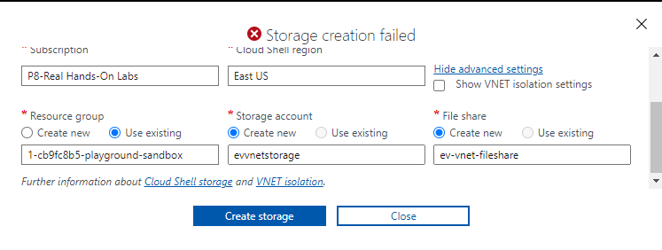

PowerShell should start to initialize now.

In PowerShell, we can create all of our resources just as we would in the Azure portal. I used the following link to gather the PowerShell commands needed to create a Vnet (https://learn.microsoft.com/en-us/azure/virtual-network/quick-create-powershell).

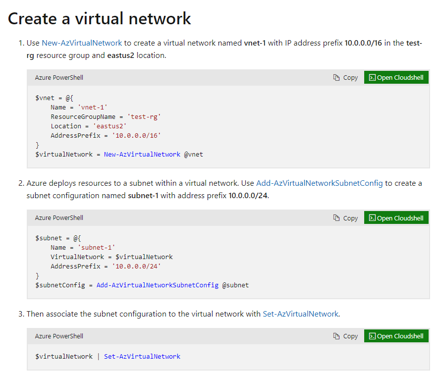

This website used hastables and variables for the virtual network creation. I'm unfamiliar with hashtables so asked Chat GPT what each part of code represents.

`$vnet` creates a variable with the following information: `Name`, `ResourceGroupName`, `Location`, and `AddressPrefix`. This syntax is called a hashtable and it stores all of the parameters in a form that allows PowerShell to use it. You have to put everything in the following format `@{ }`. Once you create this `vnet` variable, you can create the actual virtual network which you'll also assign to a variable `$VirtualNetwork` (convenient for later use) by setting the new variable equal to the PowerShell cmdlet and using @vnet to pass through the parameters you want the cmdlet to use to create the vnet.

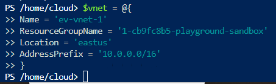

In our case, we set the hashtable variable to `$vnet` and input all of our information. I assigned the overall Vnet a CIDR of /16. Once this was completed, I created the actual Virtual Network using variable `$EVvnet` and the `New-AzVirtualNetwork` cmdlet and the hashtable values set by `$vnet`.

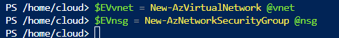

## Create and Associate a Network Security Group

I created the Network Security Group in the same fashion as the Virtual Network. I input the `Name`, `ResourceGroupName`, and `Location` parameters into the variable `$nsg`.

Then, I created the actual NSG using variable `$EVnsg`, the `New-AzNetworkSecurityGroup` cmdlet, and the hashtable values set by `$nsg`.

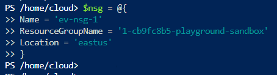

## Create a Primary and Secondary Subnet

The subnets are created in the same fashion as both the virtual network and the network security group. I defined the Name, Virtual Network, CIDR, and NSG for both the primary and the secondary subnets using two separate variables. 

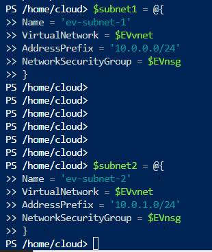

Then, I called the variables to make sure they had the correct values I assigned. 

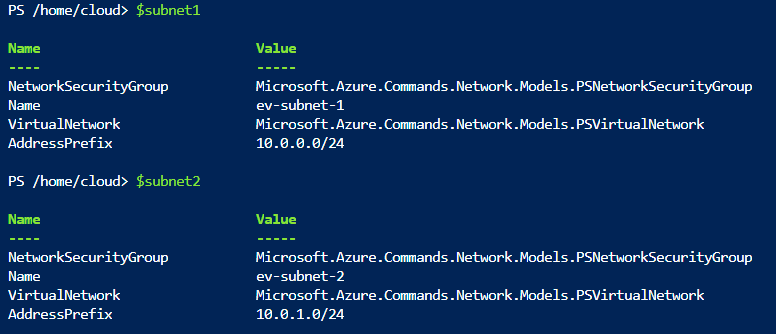

Once that was confirmed, I started to build the actual subnets that will be appended to the virtual network we created. We have to use the `Add-AzVirtualNetworkSubnetConfig` cmdlet to do this and use the variables we created to supply this cmdlet with the correct information.
Now, if you're anything like me, you would think "Why did we use the `Add-` cmdlet instead of the `New-` cmdlet this time?" Well, that's what Chat GPT is for lol. The `New-` cmdlet creates a new instance of a resource that never existed. Since our virtual network didn't exist, we used the `New-` cmdlet. We use the 
`Add-` cmdlet when we're adding a resource onto a resource that already exists. Technically, we're adding this subnets onto the virtual network (that already exists now) so we had to use `Add-` instead of `New-`. 

So, we created the the actual subnet variables `$SubnetConfig1` and `$SubnetConfig2` by using the `Add-` cmdlet and specifying where PowerShell should get the information from ( `$subnet1` and `$subnet2` ). 

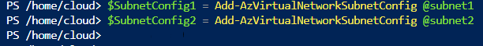

Once this is complete, you've only added the subnets to the configuration memory. You haven't actually added them to production yet. In order to update our virtual network production environment with the new subnets, we'll use the `$EVvnet | Set-VirtualNetwork` cmdlet. 

Lets break this down. This command tells us to take the output from the left side ( `$EVvnet` ) and put it into the output on the right side. We can look at the `Set-` cmdlet as an update feature. We added the subnets to the `$EVvnet` variable but now we have to update it in production. `Set-` updates the existing variable. 

This is important because we want to have total control when we're creating and provisioning environments. What if we make a mistake in an update? This allows us to update the configuration memory first and when we're happy with the final results, we can then update the production environment. 

This is similar to in Cisco Firepower Management Center (FMC) where you can create an ACL, save the ACL, and then go to the deployment section to actually deploy it. It gives you more granular control of changes. 

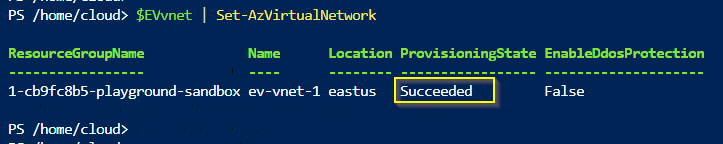

We can now look into the portal and verify that all of our resources were created. 

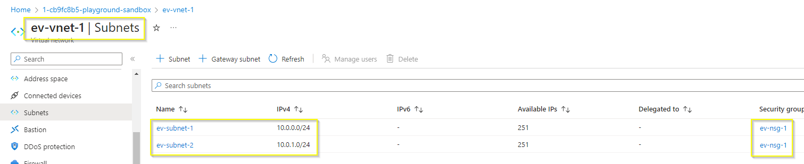

And for extra practice, I decided to delete the Vnet and NSG at the end using the `Remove-` cmdlets. 

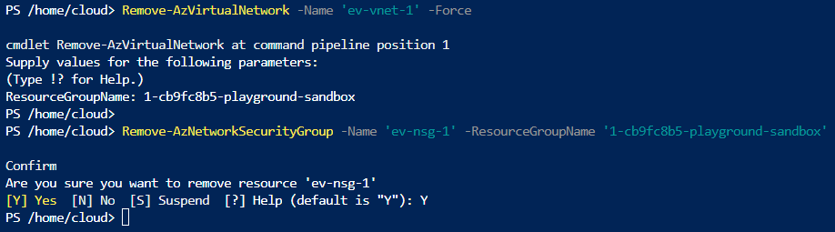

## Personal Notes

* I learned how to use the copy and paste feature. You have to actually right click and press paste. Ctrl + V wasn't working. 
* I learned the difference between `New-`, `Add-`, and `Set-`. I already learned that you have to actually name the parameters you want when using the `Get-` cmdlet.
* The hashtables are pretty cool and useful.
